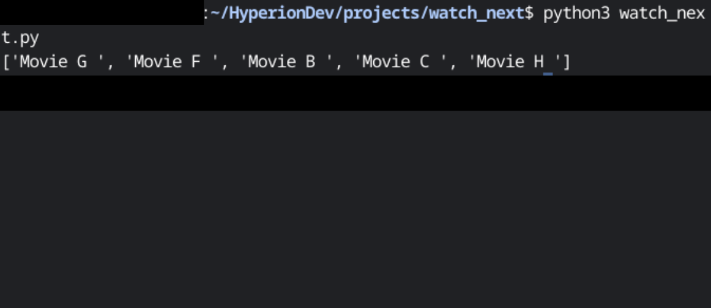

# finalCapstone

## watch_next

The project uses a Python script that recommends movies based on a watched movie description. 
It uses the NumPy library for working with arrays and matrices, the spaCy library for natural language processing (NLP), and the Pandas library 
for data manipulation.

## Table of Contents
- [Requirement](#requirement)
- [Installation](#installation)
- [Usage](#usage)
- [Sample Output](#sample-output)
- [License](#license)

## Requirement
- Python 3.x
- NumPy
- spaCy
- Pandas

## Installation
1. Clone the repository:

   ```bash
   git clone https://github.com/al1A91/finalCapstone.git


1. Install the required libraries:
   ```bash
   pip install numpy spacy pandas

2. Download the spaCy English language model:
   ```bash
   python -m spacy download en_core_web_md

4. Prepare the movie data:

Create a text file named movies.txt.
Enter the movie data in the following format: title:description. Each movie should be on a separate line.
Example data found in the main.

## Usage
1. Open a terminal or command prompt.

2. Navigate to the project directory:
   ```bash
   cd {location}

4. Run the script
   ```bash
   python watch_next.py
 
5. If multiple versions of Python are installed, specify the correct version, e.g., python3 watch_next.py.
   ```bash
   python3 watch_next.py
   
6. The script will recommend a list of similar movies based on the description.

## Sample output



## License

This project is licensed under the [MIT License](./LICENSE).


